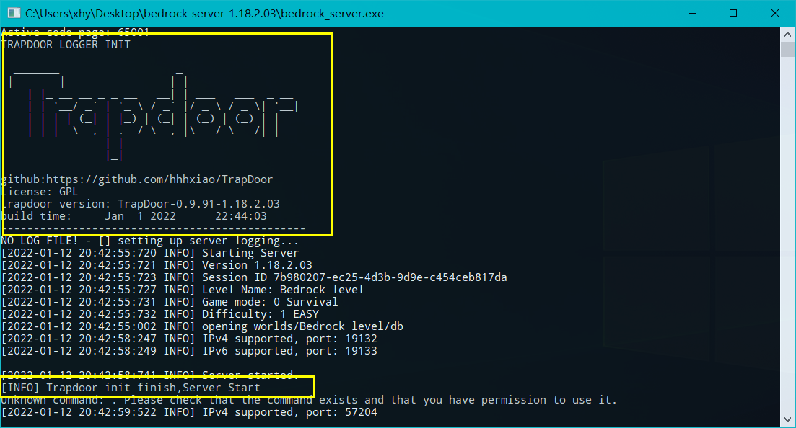

## 0. 阅读并同意免责声明

作为用户，你首先需要明确：**使用trapdoor带来的功能就意味着承担第三方软件带来的风险。**为了不给开发者带来不必要的麻烦，请阅读如下的免责声明，如果**你使用了trapdoor就意味着你自动同意了该声明**。


```txt
免责声明

trapdoor(以下简称tr)是一个利用dll远程注入技术开发的BDS辅助软（插）件，它提供了不少方便玩家的功能，给生电玩家创造了便利。此外，tr本身是开源免费的，内部没有任何恶意代码，原则上也不会对存档造成任何损害。

但是考虑到此类软件的特殊性，开发者无法完全保证tr对用户的存档不造成任何破坏，万一发生意外情况，开发者不会也没有能力对tr对用户
造成的损失负责。

如果你继续使用tr插件，那么就代表你同意了该声明(或者说叫用户协议)，如果你不想承担此类风险，请停止使用tr插件。

附录： 以下是一些使用建议:
- 及时更新插件到新版本，因为目前tr还是beta版，理论上越更新bug肯会越少
- 尽量关闭不用的功能
- 及时备份存档永远是好习惯
2022.1.11
```

## 1. 下载BDS

插件是依托于BDS的，因此使用trapdoor之前需要下载BDS。前往[https://www.minecraft.net/en-us/download/server/bedrock](https://www.minecraft.net/en-us/download/server/bedrock)下载**正确版本**的Windows版的BDS文件，并解压到任意文件夹。
:::warning
**文件夹路径中不建议包含中文字符。**
:::

## 2. 开启Loop back

UWP应用默认关闭了loop back（就是默认情况下UWP应用无法连接localhost）,你需要开启才能连接本地服务器，**如果是云服务器的多人游戏可以省去这一步**。以管理员权限打开`powershell`,并运行如下命令(该命令来自微软官网):

```powershell
CheckNetIsolation.exe LoopbackExempt -a -p=S-1-15-2-1958404141-86561845-1752920682-3514627264-368642714-62675701-733520436
```

如果该步骤顺利的话`powershell`会输出"完成"二字，如下图所示：


### 3. 下载并安装插件本体

前往[Trapdoor的下载页面](https://github.com/hhhxiao/TrapDoor/releases)下载对应版本的文件，下载的文件格式是是`trapdoor-{mod version}-{game version}.zip`，其中`mod version`表示插版本，`game version`表示支持的游戏版本,注意**trapdoor不是向下兼容的，使用时版本一定要严格对应，插件和BDS的三级版本号一定要完全一样**。
下图展示了下载页面：


**解压下载到的压缩包，把所有文件复制到BDS的根目录即可**这时候相关配置文件的路径如下所示：
```
└───bedrock-server-xxx
  └───plugins
    └───trapdoor
        ├───trapdoor-config.json
        └───langs
```

:::tip
在更新的版本(0.10+)中trapdoor将语言文件内建到了插件内内部，首次启动会自动生成配置文件，因此这一步可以跳过，直接注入即可。
:::

## 4. 配置配置文件

创造服一般可用不配置，生存服可能需要根据需求关闭部分功能(如tick，漏斗计数器等)。具体配置参考配置文件一节。

## 5. 注入dll并启动BDS

使用任意的dll注入器或者mod加载器(注意是**64位**)把plugins文件夹中的`trapdoor-*.dll`注入到`bedrock_server.exe`中并启动，这里有一个可用的开源注入器[https://github.com/DarthTon/Xenos/releases/tag/2.3.2 ](https://github.com/DarthTon/Xenos/releases/tag/2.3.2 )

如果你是使用的`Xenos`这个软件，下面的看图即可:


如果你使用其它的BDS专用加载器（如Liteloader等），请去访问它们的wiki页面以获得技术支持。

下面是BDS正常启动以及插件正常加载后的截图：



如果你在服务器页面看到了Trapdoor的字符画以及类似`Trapdoor init finish,Server started`这一行字就说明插件注入成功了。

## 6. 加载材质包
点击[https://github.com/OEOTYAN/Trapdoor-CUI/releases](https://github.com/OEOTYAN/Trapdoor-CUI/releases)下载材质包，然后客户端加载该材质包即可(**不是服务端，是每个玩家都要在本地加载，和普通材质包一样使用**)，加载好的游戏截图如下所示：


## 7. 连接服务器进入游戏

如果你是本地开服,ip填`127.0.0.1`或者·`localhost`，如果你用的是云服务器而不是本地，填公网ip即可。端口按照自己的设置在服务器的配置文件里面改，默认`19132`。


